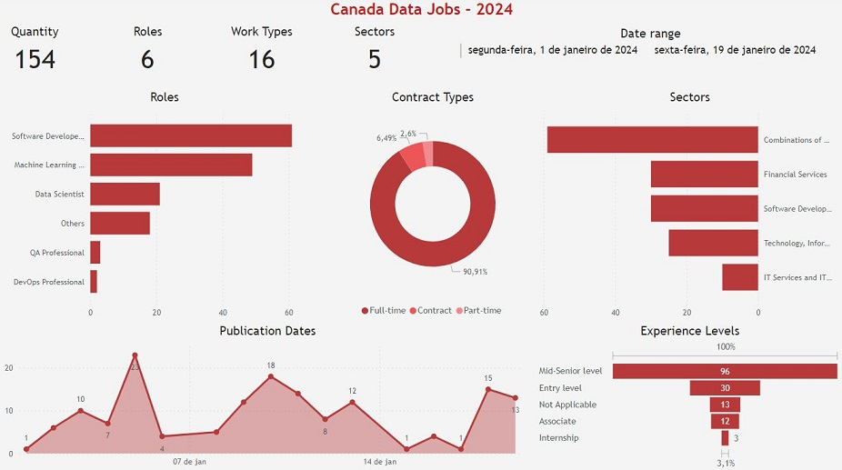

# Canada Data Jobs 2024 - Preparação de dados - Dashboard de protótipo

Projeto de criação de scripts Python para preparação (limpeza e organização) dos dados de vagas de 
emprego do Canadá do início de 2024. 
O projeto também possui um protótipo de Dashboard feito no PowerBI. 
Os dados foram obtidos a partir do LinkedIn e postados no Kaggle por outro pessoa.

## Arquivos
Os arquivos do projeto são:
- `dashboard/DashboardPrototype-CanadaDataJobs.jpg`: imagem do protótipo de dashboard;
- `dashboard/DashboardPrototype-CanadaDataJobs-V2.jpg`: imagem da versão 2 do protótipo de dashboard;
- `dashboard/DashboardPrototype-CanadaDataJobs.pbix`: arquivo do Microsoft Power BI para o protótipo de dashboard;
- `dashboard/DashboardPrototype-CanadaDataJobs.pdf`: pdf com imagem do protótipo de dashboard;
- `data/linkedin_canada.csv`: dados originais obtidos no Kaggle;
- `data/dataset.csv`: dados limpos e filtrados;
- `dictionaries/sectors.json`:arquivo json cujos chaves são os nomes originais de "sector", que devem ser substituidos 
   por novos valores;
- `dictionaries/titles.json`: arquivo json cujos chaves são os nomes originais de "title", que devem ser substituidos 
   por novos valores;
- `scripts/preparator.py`: script python para limpar e filtrar o `data/linkedin_canada.csv` e criar `data/dataset.csv`; 

## Protótipo de Dashboard
Para os dados limpos e filtrados de `data/dataset.csv` foi criado um protótipo de dashboard usando o Microsoft 
Power BI:

## Referências
kaggle - Linkedin Canada: Data Science Jobs 2024 - Kanchana1990: 
https://www.kaggle.com/datasets/kanchana1990/linkedin-canada-data-science-jobs-2024