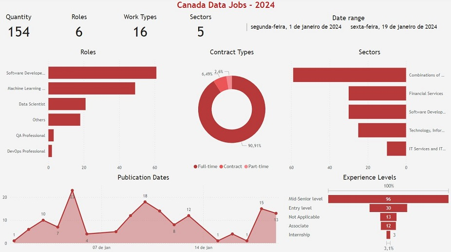

# Canada Data Jobs 2024 - Data Preparation - Prototype Dashboard

Project to create Python scripts for preparing (cleaning and organizing) Canadian job vacancy data 
from the beginning of 2024. 
The project also has a Dashboard prototype made in PowerBI. 
The data was obtained from LinkedIn and posted on Kaggle by another person.

## Files
The project files are:
- `dashboard/DashboardPrototype-CanadaDataJobs.jpg`: image of the dashboard prototype;
- `dashboard/DashboardPrototype-CanadaDataJobs.pbix`: Microsoft Power BI file for the dashboard prototype;
- `dashboard/DashboardPrototype-CanadaDataJobs.pdf`: pdf with image of the dashboard prototype;
- `data/linkedin_canada.csv`: original data obtained from Kaggle;
- `data/dataset.csv`: clean and filtered data;
- `dictionaries/sectors.json`: json file whose keys are the original "sector" names, which must be replaced
    for new values;
- `dictionaries/titles.json`: json file whose keys are the original "title" names, which must be replaced
    for new values;
- `scripts/preparator.py`: python script to clean and filter `data/linkedin_canada.csv` and create `data/dataset.csv`;

## Dashboard Prototype
For the cleaned and filtered data from `data/dataset.csv`, a dashboard prototype was created using Microsoft
PowerBI:

## References
kaggle - Linkedin Canada: Data Science Jobs 2024 - Kanchana1990: 
https://www.kaggle.com/datasets/kanchana1990/linkedin-canada-data-science-jobs-2024